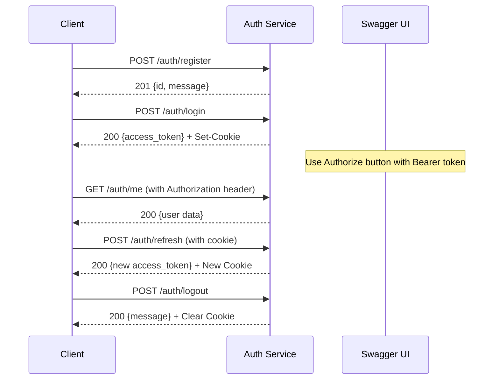

# Swagger API Documentation Usage Guide

## Access Swagger UI

Once your auth service is running, you can access the interactive API documentation at:

**🌐 Swagger UI**: http://localhost:3001/api-docs

**📄 Swagger JSON**: http://localhost:3001/api-docs.json

## Features

### 🎯 Interactive Testing
- **Try It Out**: Click "Try it out" on any endpoint to test it directly
- **Authorization**: Use the "Authorize" button to set your Bearer token
- **Real Responses**: See actual API responses and status codes

### 📋 Complete Documentation
- **Request/Response Schemas**: Detailed parameter and response formats
- **Error Examples**: Common error responses for each endpoint
- **Authentication**: JWT Bearer token setup instructions
- **Rate Limiting**: Information about rate limits per endpoint

## How to Use

### 1. Start the Service
```bash
npm run dev
```

### 2. Open Swagger UI
Navigate to: http://localhost:3001/api-docs

### 3. Test Endpoints

#### For Public Endpoints (no auth required):
1. **Register**: POST /auth/register
   - Click "Try it out"
   - Fill in the request body:
   ```json
   {
     "email": "test@example.com",
     "password": "SecurePass123!",
     "full_name": "Test User"
   }
   ```
   - Click "Execute"

2. **Login**: POST /auth/login
   - Use the credentials from registration
   - Copy the `access_token` from the response

#### For Protected Endpoints (auth required):
1. **Set Authorization**:
   - Click the "Authorize" button at the top
   - Enter: `Bearer your_access_token_here`
   - Click "Authorize"

2. **Test Protected Endpoints**:
   - GET /auth/me - Get user profile
   - POST /auth/logout - Logout user

### 4. Token Refresh
- The POST /auth/refresh endpoint uses HTTP-only cookies
- You may need to use a browser or tool that supports cookies for testing

## API Authentication Flow



## Response Examples

### Success Response (Register)
```json
{
  "id": "123e4567-e89b-12d3-a456-426614174000",
  "message": "User registered"
}
```

### Success Response (Login)
```json
{
  "access_token": "eyJhbGciOiJSUzI1NiIsInR5cCI6IkpXVCJ9..."
}
```

### Error Response (Validation)
```json
{
  "error": "Bad Request",
  "message": "Validation failed",
  "details": [
    {
      "field": "email",
      "error": "Email is required"
    }
  ]
}
```

## Rate Limiting Information

| Endpoint | Rate Limit | Window |
|----------|------------|---------|
| POST /auth/register | 3 requests | 1 hour |
| POST /auth/login | 5 requests | 15 minutes |
| POST /auth/refresh | 50 requests | 15 minutes |
| GET /auth/me | 100 requests | 15 minutes |
| POST /auth/logout | 100 requests | 15 minutes |

## Security Headers

All responses include security headers:
- `X-Content-Type-Options: nosniff`
- `X-Frame-Options: DENY`
- `X-XSS-Protection: 1; mode=block`

## Cookie Settings

Refresh tokens are stored in HTTP-only cookies with:
- `HttpOnly`: Prevents JavaScript access
- `Secure`: HTTPS only (in production)
- `SameSite=Strict`: CSRF protection
- `Max-Age`: 7 days

## Tips for Testing

1. **Use Browser Developer Tools**: Check cookies and headers in Network tab
2. **Copy JWT Tokens**: Use the copy button in Swagger responses
3. **Test Error Cases**: Try invalid data to see error responses
4. **Rate Limiting**: Test rate limits by making multiple requests quickly
5. **Token Expiry**: Access tokens expire in 15 minutes - use refresh to get new ones

## Customization

The Swagger UI includes:
- **Persistent Authorization**: Your bearer token is saved during the session
- **Request Duration Display**: See how long each request takes
- **Filter Support**: Search through endpoints
- **Try It Out**: Test all endpoints interactively

## Integration with API Gateway

When deployed behind an API Gateway:
- Update server URLs in `/src/config/swagger.js`
- Ensure Gateway forwards cookies for refresh endpoint
- Configure Gateway to skip JWT validation for public endpoints

## Troubleshooting

### Common Issues:

1. **Authorization not working**:
   - Ensure you're using `Bearer ` prefix
   - Check token hasn't expired (15 min limit)

2. **Refresh endpoint failing**:
   - Use browser that supports cookies
   - Check cookie settings in browser

3. **CORS errors**:
   - Check CORS configuration in main app
   - Ensure proper origin settings

4. **Rate limit errors**:
   - Wait for rate limit window to reset
   - Check rate limit headers in response 